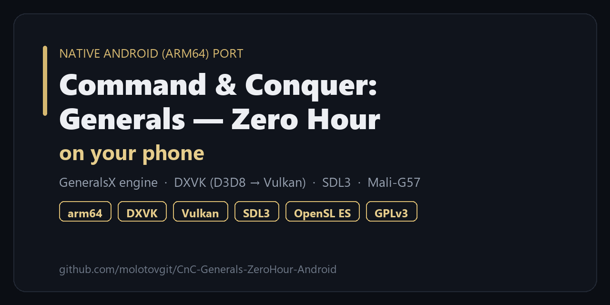

  

# Command & Conquer: Generals — Zero Hour on Android

> *A 2003 Direct3D 8 real-time-strategy game, running **natively** on an Android phone — no emulator, no
> cloud streaming. The real engine, its D3D8 calls translated to Vulkan on the phone's own GPU.*

An **Android (arm64) port** of *Command & Conquer: Generals — Zero Hour*, running the
original game engine natively on a phone through
[**GeneralsX**](https://github.com/fbraz3/GeneralsX) (the GPLv3 cross-platform fork of the
engine source EA released in 2025), **SDL3** for windowing/input, and **DXVK** translating
the game's Direct3D 8 calls to **Vulkan** on Mobile GPUs (tested on Mali‑G57).

It reaches the main menu, plays skirmish and the single‑player campaigns, renders terrain,
units, water, shadows, the HUD, the minimap and the in‑engine/​video cutscenes — with a
touch‑first control scheme designed for a phone.

> **This repository contains only source code and documentation, licensed under the GPLv3.**
> It does **not** include any game data. The `.big` archives, movies, maps and other art/audio
> are Electronic Arts' copyrighted content — you must supply your own from a retail copy of the
> game. See [docs/GAME-FILES.md](docs/GAME-FILES.md).

---

## Status

| Area | State |
|---|---|
| Boot → main menu | ✅ working, native 1640×720 fullscreen |
| Skirmish (all factions) | ✅ playable |
| Single‑player campaigns (USA / GLA / China) | ✅ playable, intro cutscenes play |
| Rendering (terrain / units / water / shadows / HUD) | ✅ correct on Mali‑G57 |
| Minimap / radar | ✅ (campaign always‑on, skirmish/MP radar‑gated as on desktop) |
| Audio (music / SFX / speech) | ✅ via OpenSL ES |
| Video cutscenes (Bink via FFmpeg) | ✅ decodes on device |
| Touch controls | ✅ full custom scheme (see below) |
| LAN multiplayer | 🚧 in progress |

---

## Screenshots & demo

Running on a Redmi (Mali‑G57), landscape, at native resolution.

> 📸 **Got it running?** A short gameplay clip or a screenshot is the single most useful thing you can
> contribute to help this project reach people — post yours in
> **[Show and tell](https://github.com/molotovgit/CnC-Generals-ZeroHour-Android/discussions/7)**
> (media only — never a built APK or game data). Standout shots can feature right here.

---

## Touch controls

The game was mouse+keyboard only; this port adds a purpose‑built multi‑touch scheme:

| Gesture | Action |
|---|---|
| 1‑finger tap | select / press a UI button |
| 1‑finger drag | drag‑box select / drag a slider |
| 2‑finger drag | pan the camera |
| 2‑finger pinch | zoom the camera |
| 2‑finger tap | right‑click (move / attack order) |
| On‑screen **☰** button (top‑left, in‑game) | opens the pause/ESC menu |
| On‑screen **▶▶** button (top‑right, during a video) | skip the cutscene |

Camera pan/zoom speed is adjustable and **persisted** via **Options → Scroll Speed**.

---

## Quick start (play now)

1. Get an **arm64 Android** device with **~5 GB free**.
2. Install the **self‑contained APK** (bundles the game data and unpacks it on first launch).
   *(The self‑contained build is not hosted in this repo — it embeds copyrighted game data.
   Build your own from your retail files.)*
3. First launch shows *"Installing game data…"* for ~1–2 minutes, then the game starts.

👉 **New here? Follow [docs/SETUP-GAME-FILES.md](docs/SETUP-GAME-FILES.md)** — a step‑by‑step guide
to configuring your own Generals files into a playable APK (find your install → copy the `.big`
files + `Data/` → one packaging command → build → install).

If you already have the game data deployed to the app's storage, the small engine‑only APK
boots straight into the game.

---

## Build it yourself

Full instructions are in **[BUILDING.md](BUILDING.md)**. In short:

- Cross‑compile the engine for `arm64-v8a` with the Android NDK + CMake (vcpkg pulls SDL3,
  OpenAL, FFmpeg; DXVK is built separately).
- Package the Android app (`android/`) with Gradle; drop the built `libmain.so` into
  `app/libs/arm64-v8a/`.
- Supply your own retail game data (see [docs/GAME-FILES.md](docs/GAME-FILES.md)).

---

## How it works / what was fixed

Getting a 2003 Direct3D 8 RTS to run on a mobile Vulkan driver took a long series of fixes.
Each is written up in detail under **[docs/](docs/)**, and summarized in
**[CHANGELOG.md](CHANGELOG.md)**. Highlights:

- **[Rendering bring‑up on Mali (DXVK → Vulkan)](docs/fixes/rendering-dxvk-mali.md)** — reaching
  the menu and in‑game.
- **[The Mali shader‑compiler crash](docs/fixes/mali-shader-cmpbe-crash.md)** — root‑caused to
  D3D9 user clip planes (`gl_ClipDistance`) crashing the Mali‑G57 shader compiler.
- **[True fullscreen at native resolution](docs/fixes/fullscreen-native-resolution.md)**.
- **[Magenta terrain / software BC (DXT) decode](docs/fixes/terrain-textures-bc-decode.md)**.
- **[Minimap / radar rendering & availability](docs/fixes/minimap-radar.md)**.
- **[Audio via OpenSL ES](docs/fixes/audio-opensl.md)**.
- **[Cutscene playback + the on‑screen Skip button](docs/fixes/cutscenes-video.md)**.
- **[Touch control scheme](docs/fixes/touch-controls.md)**.
- **[Self‑contained APK packaging](docs/fixes/self-contained-packaging.md)**.

See **[docs/PORTING-NOTES.md](docs/PORTING-NOTES.md)** for the full technical journal, and
**[docs/DISCOVERIES.md](docs/DISCOVERIES.md)** for in-depth engineering write-ups of the
non-obvious findings — the `__linux__`-includes-Android audio trap, the 10-bit-swapchain black
radar, the 16-bit sorting-buffer heap corruption, the touch→RTS input synthesis, and more.

---

## Community & contributing

This is a volunteer, non-commercial community project — help is very welcome, especially with
**GPU compatibility** (Adreno/PowerVR/Xclipse), **LAN multiplayer**, controls, and performance.

- 💬 **Questions, ideas, show-and-tell:** [Discussions](https://github.com/molotovgit/CnC-Generals-ZeroHour-Android/discussions) — start with the
  [👋 welcome thread](https://github.com/molotovgit/CnC-Generals-ZeroHour-Android/discussions/1), the
  [🎮 get-it-running guide](https://github.com/molotovgit/CnC-Generals-ZeroHour-Android/discussions/2),
  or post your hardware in [🧭 device compatibility](https://github.com/molotovgit/CnC-Generals-ZeroHour-Android/discussions/4).
- 🐛 **Bugs & feature requests:** [open an issue](https://github.com/molotovgit/CnC-Generals-ZeroHour-Android/issues/new/choose)
- 🛠️ **Want to contribute code?** Read **[CONTRIBUTING.md](CONTRIBUTING.md)** and the
  **[ROADMAP.md](ROADMAP.md)** — the "Help wanted" section lists good first areas.
- 🤝 We follow a **[Code of Conduct](CODE_OF_CONDUCT.md)**.
- 🔒 Security issues: see **[SECURITY.md](SECURITY.md)** (please report privately).
- ❓ Need help getting it running? **[SUPPORT.md](SUPPORT.md)**.

> **One hard rule:** never post, attach, or link game data (`.big`/`.bik`/maps/ISOs) or a built
> self-contained APK. Everyone brings their own retail files. See
> [docs/GAME-FILES.md](docs/GAME-FILES.md).

**⭐ If a native *Generals* on Android sounds cool, star the repo** — that's the main way other C&C
fans and Android tinkerers find it, and it's the biggest single thing you can do to help.

---

## Credits & license

- **Engine:** [GeneralsX](https://github.com/fbraz3/GeneralsX) by fbraz3 and contributors — the
  GPLv3 cross‑platform fork this port builds on.
- **Original source:** *Command & Conquer: Generals* / *Zero Hour*, released by **Electronic Arts**
  under **GPLv3** in 2025.
- **Libraries:** [SDL3](https://libsdl.org), [DXVK](https://github.com/doitsujin/dxvk),
  [OpenAL Soft](https://github.com/kcat/openal-soft), [FFmpeg](https://ffmpeg.org).

This project is licensed under the **GNU General Public License v3.0** — see [LICENSE](LICENSE).

*Command & Conquer, Generals, Zero Hour and all game assets are trademarks/copyright of
Electronic Arts. This is an unofficial, non‑commercial, community port of the GPLv3 engine
source. No game assets are distributed here.*
